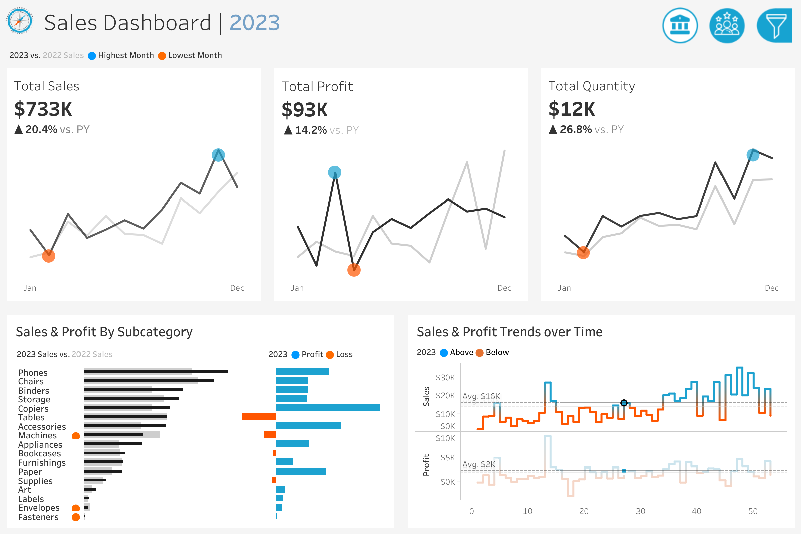

# Sales and Customer Analysis Dashboard
The purpose of sales dashboard is to present an overview of the sales metrics and trends in order to analyze year-over-year sales performance and understand sales trends.

## Project Overview
In this project, I developed two interactive Tableau dashboards to analyze sales performance and customer behavior.

My goal was to transform raw transactional data into a clear and practical business intelligence solution that helps stakeholders monitor key performance indicators, compare current results with the previous year, identify important trends, and better understand customer purchasing patterns.

The analysis covers data from 2020 to 2023, with the main dashboard view focused on 2023 performance compared with 2022.

## Target Users

The dashboards were designed for:
Sales managers
Business executives
Marketing teams
Data analysts
Other stakeholders involved in performance monitoring and decision-making

## Business Problem

Sales and marketing teams need a simple way to answer several important business questions:

How are sales, profit, and order quantity changing compared with the previous year?
Which months and weeks generate the strongest and weakest results?
Which product subcategories generate high sales but relatively low profit?
How many customers are actively purchasing?
How frequently do customers place orders?
Which customers contribute the most profit to the business?

I created these dashboards to provide a consolidated view of these metrics and make the results easier to explore through interactive filters and visualizations.

# Dashboards
## 1. Sales Performance Dashboard

I created the Sales Performance Dashboard to provide a high-level overview of business performance and highlight changes over time.

The dashboard includes:

Total Sales
Total Profit
Total Quantity Sold
Year-over-year KPI comparisons
Monthly sales and profit trends
Weekly sales and profit trends
Highest- and lowest-performing periods
Sales and profit comparison by product subcategory
Weekly performance compared with the average
Interactive year and category filters

The dashboard allows users to quickly determine whether business performance improved or declined compared with the previous year.

# 2. Customer Analysis Dashboard

I developed the Customer Analysis Dashboard to explore customer activity, purchasing frequency, and profitability.

The dashboard includes:

Total number of customers
Sales per customer
Total number of orders
Year-over-year customer KPI comparisons
Monthly customer trends
Customer distribution by number of orders
Top 10 customers by profit
Number of orders placed by each top customer
Most recent purchase date
Interactive filters for detailed analysis

This dashboard helps identify valuable repeat customers and understand how customer engagement changes throughout the year.

# Data Preparation

For this project, I worked with transactional data stored in CSV files.

The dataset includes information about:

Customers
Orders
Products
Sales
Profit
Quantity
Product categories and subcategories
Geographic regions
Order and shipping dates

Before building the dashboards, I reviewed the data structure, checked field types, created the necessary relationships between tables, and prepared calculated fields for the analysis.

I also created calculations for:

Current-year values
Previous-year values
Year-over-year differences
Percentage changes
Monthly and weekly trends
Average weekly performance
Customer-level KPIs
Sales per customer
Order frequency

# Key Findings

Based on the 2023 dashboard results, I identified several important patterns.

## Overall Business Growth

Sales, profit, quantity sold, and the number of orders increased compared with 2022. This indicates positive overall business growth during the analyzed period.

## Seasonal Performance

Sales and customer activity were not distributed evenly throughout the year. The strongest results appeared toward the end of the year, suggesting a clear seasonal pattern in customer demand.

## Sales Do Not Always Equal Profit

Some product subcategories generated relatively high sales but produced much lower profit. This demonstrates why sales revenue should be analyzed together with profitability and margins.

## Customer Concentration

A relatively small group of customers generated a significant share of total profit. These customers may represent an important segment for retention and personalized marketing activities.

## Customer Order Frequency

Most customers placed between one and three orders. Customers with four or more orders formed a smaller but potentially more valuable repeat-customer segment.

# Skills Demonstrated

Through this project, I demonstrated my ability to:

Define and calculate business KPIs
Perform year-over-year analysis
Analyze monthly and weekly trends
Compare sales and profitability
Segment customers based on purchasing behavior
Analyze customer order frequency
Create calculated fields in Tableau
Use parameters and interactive filters
Build dynamic and user-friendly dashboards
Apply business-focused data storytelling
Translate business requirements into analytical solutions
Present analytical findings clearly to stakeholders

# Tools and Technologies
Tableau Public — dashboard development and data visualization
CSV — source data storage
Tableau calculated fields — KPI and year-over-year calculations
Data relationships and joins — connecting multiple source tables
GitHub — project documentation and file storage
Business intelligence — performance monitoring and analytical reporting

# Repository Structure
sales-customer-tableau-analysis
│
├── dashboards
│   ├── sales_performance_dashboard.png
│   └── customer_analysis_dashboard.png
│
├── data
│   ├── Customers.csv
│   ├── Orders.csv
│   └── Products.csv
│
├── tableau
│   └── Sales_Customer_Analysis.twbx
│
├── README.md
└── LICENSE

# Tableau Public Dashboard

The interactive version of the project is available on Tableau Public:

View the live dashboard on Tableau Public

[Dashboard](sales_dashboard)

[Open Sales Performance in Tableau](https://public.tableau.com/views/SalesPerformance_17812481754140/SalesDashboard?:language=en-US&:sid=&:redirect=auth&:display_count=n&:origin=viz_share_link)

# Key Requirements

## KPI Overview
Display a summary of total sales, profits and quantity for the current year and the previous year.

## Sales Trends
- Present the data for each KPI on a monthly basis for both the current year and the previous year.
- Identify months with highest and lowest sales and make them easy to recognize.

## Product Subcategory Comparison
- Compare sales performance by different product subcategories for the current year and the previous year.
- Include a comparison of sales with profit.

## Weekly Trends for Sales & Profit
- Present weekly sales and profit data for the current year.
- Display the average weekly values.
- Highlight weeks that are above and below the average to draw attention to sales & profit performance.

## Customer Distribution by Number of Orders
Represent the distribution of customers based on the number of orders they have placed to provide insights into customer behaviour and engagement.

## Top 10 Customers By Profit
- Present the top 10 customers who have generated the highest profits for the company.
- Show additional information like rank, number of orders, current sales, current profit and the last order date.

# Design & Interactivity Requirements

## Dashboard Dynamic
- The Dashboard should allow users to check historical data by offering them the flexibility to select any desired year.
- Provide users with the ability to navigate between the dashboards easily.
- Make the charts and graphs interactive, enabling users to filter data using the charts.

## Data Filters
Allow users to filter data by product information like category and subcategory and by location information like region, state and city.

# Project Purpose

I developed this project as part of my Data Analyst portfolio to demonstrate my practical Tableau, data visualization, KPI analysis, and business intelligence skills.

The project shows how I approach the full analytical process: from understanding business requirements and preparing data to building interactive dashboards and communicating actionable insights.

